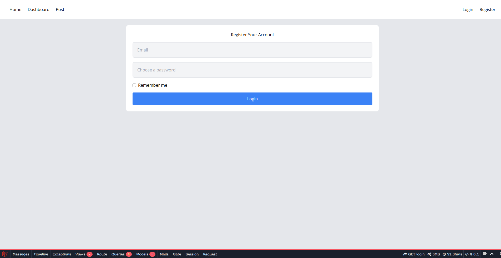

## About This Project
proyek ini menggunakan laravel 8 dan menggunakan official image docker laravel yaitu sail. applikasi ini cukup sederhana. adapun flow nya user melakukan registrasi dan login lalu dapat melakukan post dan like serta unlike post, serta maildown ketika user melakukan like makan user yang membuat status akan menerima email yang bersangkutan

## Screenshoots

    
Part of this project

    
    
    
    
    

## License

The Laravel framework is open-sourced software licensed under the [MIT license](https://opensource.org/licenses/MIT).
